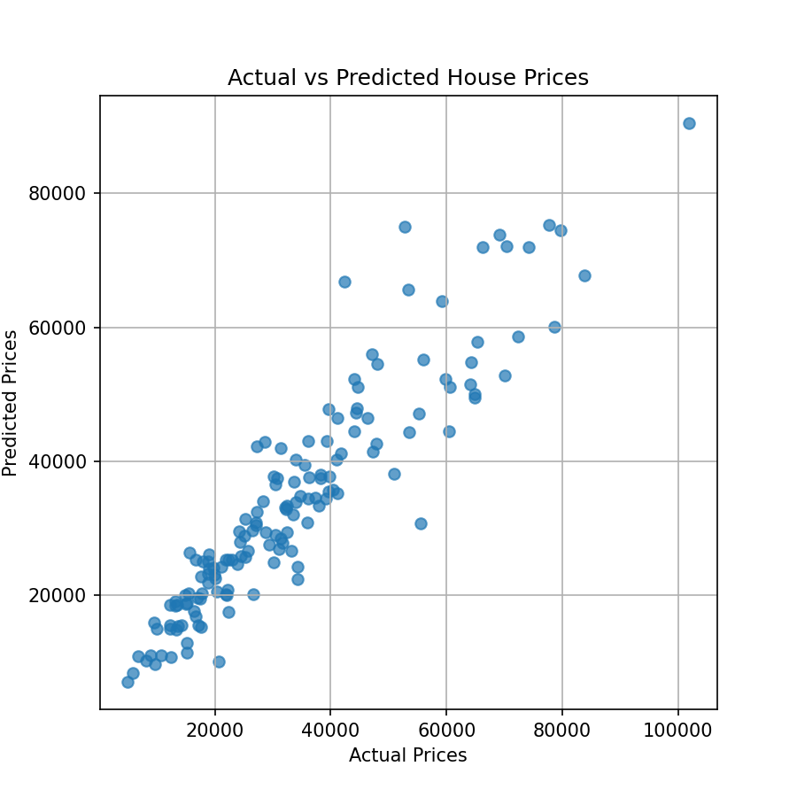
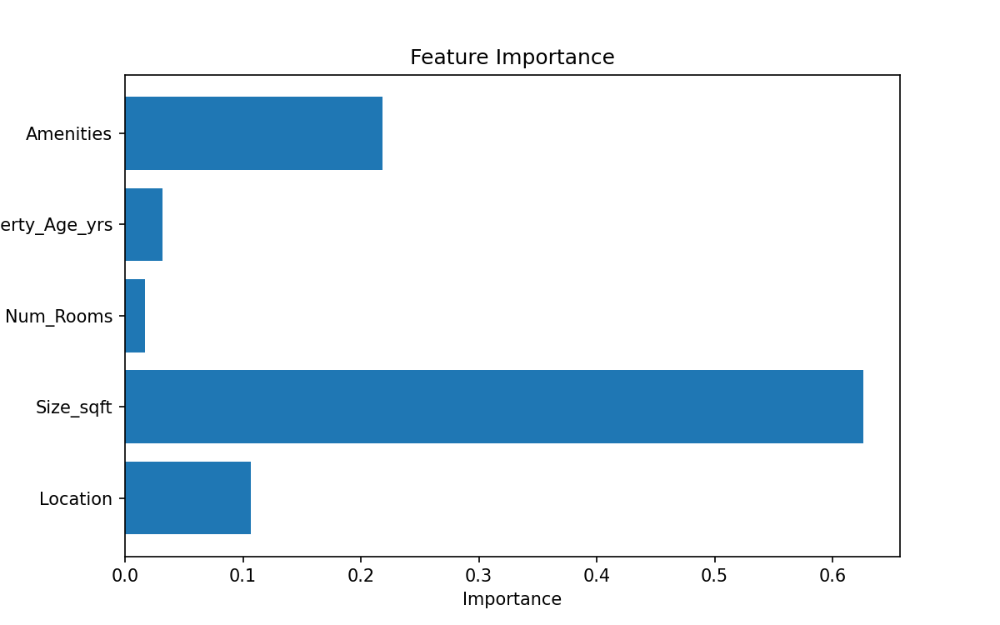

# House Price Prediction Using Machine Learning

## Overview

This project develops a machine learning-based regression model to predict house prices using property-related features such as location, size, number of rooms, property age, and amenities.

The workflow includes:

* Data preprocessing
* Exploratory Data Analysis (EDA)
* Feature encoding and scaling
* Model training and optimization
* Performance evaluation
* Feature importance analysis

---

## Technologies Used

* Python
* Pandas
* NumPy
* Scikit-learn
* Matplotlib
* Seaborn
* SHAP
* Joblib

---

## Machine Learning Model

* Random Forest Regressor
* Hyperparameter tuning using RandomizedSearchCV

---

## Evaluation Metrics

* R² Score
* RMSE (Root Mean Squared Error)

---

## Features

* House price prediction
* Feature scaling and encoding
* Hyperparameter optimization
* SHAP-based feature importance analysis
* Model persistence using Joblib

---

## Visualizations

### Actual vs Predicted House Prices



### Feature Importance Plot



### SHAP Summary Plot


---

## Project Structure

```bash
house-price-prediction-ml/
│
├── data/
│   └── properties.csv
│
├── models/
│   ├── house_price_model.pkl
│   ├── scaler.pkl
│   ├── le_location.pkl
│   └── le_amenities.pkl
│
├── outputs/
│   ├── actual_vs_predicted.png
│   ├── feature_importance.png
│   └── shap_summary.png
│
├── house_price_prediction.py
├── requirements.txt
└── README.md
```

---

## How to Run

Install dependencies:

```bash
pip install -r requirements.txt
```

Run the project:

```bash
python house_price_prediction.py
```

---

## Applications

* Real estate analytics
* Investment analysis
* Property valuation
* Data-driven decision making

---

## Author

Mansha Ajmani
